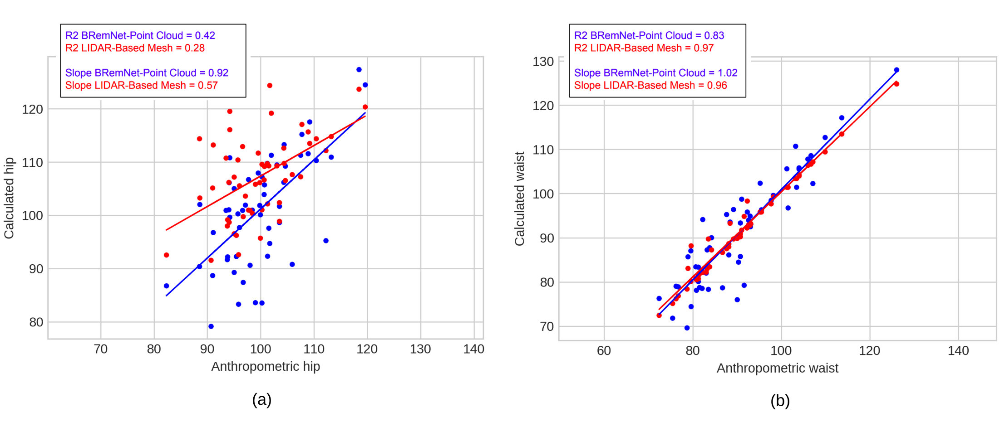

# PointCloud-ICC
Estimation of waist-to-hip ratio (Indice Cintura-Cadera) in 3D point clouds | body2vec (2020)

Abdominal Perimeter Measurements

Waist and hip approximation. (a,d) LiDAR-based mesh, (b,e) Unsegmented point cloud (scale 1:6), (c,f) BRemNet-segmented point cloud.

Linear regression of the estimated waist and hip against the actual measurements

BRemNet-Point cloud in blue and LiDAR-based mesh in red. (a) Waist and (b) hip.

## Installation
Clone this repository:
```
git clone https://github.com/aletrujim/PointCloud-ICC.git PointCloud-ICC
```
## Data adquisition
The data used in this analysis were acquired with [*body2vec*](https://doi.org/10.3390/jimaging6090094).
If you use this data or the method in your research, please cite this project.
```
@article{trujillo2020body2vec,
  title={body2vec: 3D Point Cloud Reconstruction for Precise Anthropometry with Handheld Devices},
  author={Trujillo-Jim{\'e}nez, Magda Alexandra and Navarro, Pablo and Pazos, Bruno and Morales, Leonardo and Ramallo, Virginia and Paschetta, Carolina and De Azevedo, Soledad and Ruderman, Anah{\'\i} and P{\'e}rez, Orlando and Delrieux, Claudio and others},
  journal={Journal of Imaging},
  volume={6},
  number={9},
  pages={94},
  year={2020},
  publisher={Multidisciplinary Digital Publishing Institute}
}
```
