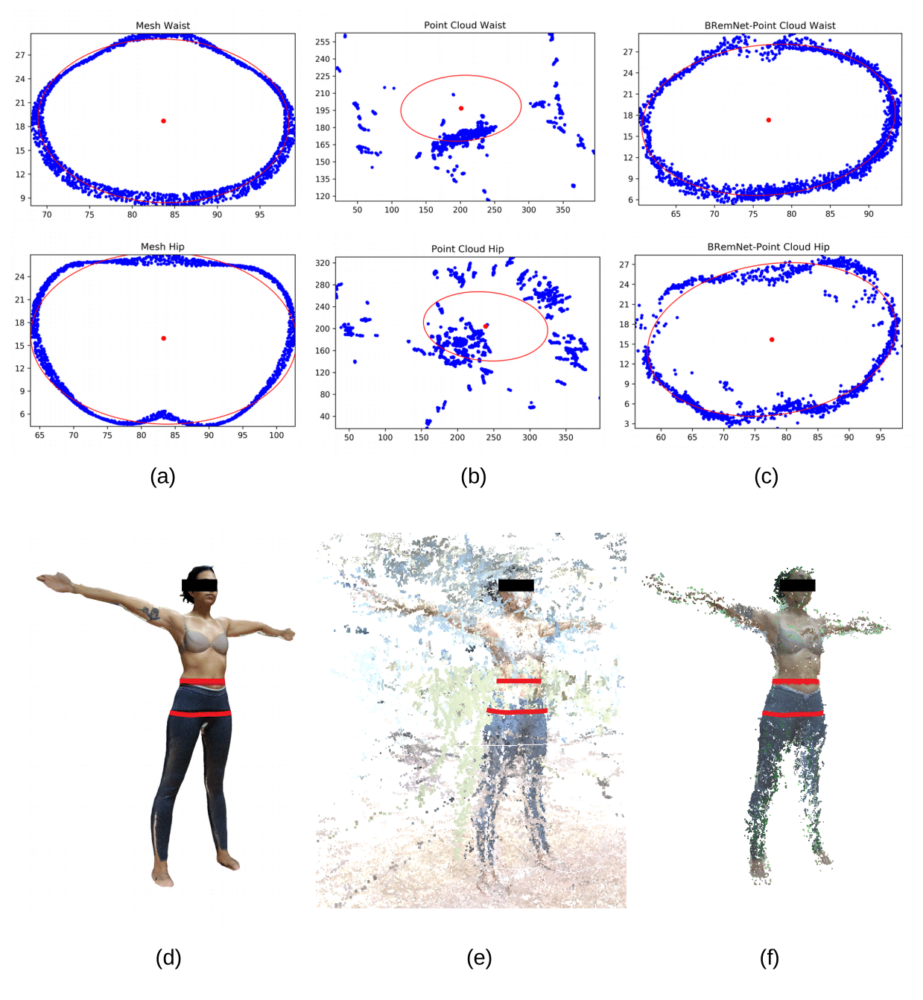

# PointCloud-ICC
Estimation of waist-to-hip ratio (Indice Cintura-Cadera) in 3D point clouds | body2vec (2020)

Our long term goal is to extract highly accurate and precise anthropometric measurements from the point clouds generated from videos taken with smartphones or similar devices. In this work, we focus on the abdominal perimeter, which is one of the most representative values related to overweight and similar conditions that currently require frequent and precise assessment in large populations given the current obesity epidemics. For this, we expect to determine the accuracy and precision of the SfM-based assessment, as compared with the LiDAR-based and with the direct measurements performed by trained anthropometrists. The procedure to this avail is to select the points that correspond to the navel height in the subject (the place where the anthropometrists take the actual abdominal perimeter), fit these points to an ellipse, in which the perimeter is the final estimation produced by the model. This navel-height point selection, ellipse fitting, and perimeter measurement is performed on the three point clouds available for the same individual (LiDAR-based, unprocessed video take, processed video take).

### Abdominal Perimeter Measurements

Waist and hip approximation. (a,d) LiDAR-based mesh, (b,e) Unsegmented point cloud (scale 1:6), (c,f) BRemNet-segmented point cloud.

### Linear regression of the estimated waist and hip against the actual measurements

BRemNet-Point cloud in blue and LiDAR-based mesh in red. (a) Waist and (b) hip.

## Installation
Clone this repository:
```
git clone https://github.com/aletrujim/PointCloud-ICC.git PointCloud-ICC
```
## Dataset
The data used in this analysis were acquired with [*body2vec*](https://doi.org/10.3390/jimaging6090094).
If you use this data or the method in your research, please cite this project.
```
@article{trujillo2020body2vec,
  title={body2vec: 3D Point Cloud Reconstruction for Precise Anthropometry with Handheld Devices},
  author={Trujillo-Jim{\'e}nez, Magda Alexandra and Navarro, Pablo and Pazos, Bruno and Morales, Leonardo and Ramallo, Virginia and Paschetta, Carolina and De Azevedo, Soledad and Ruderman, Anah{\'\i} and P{\'e}rez, Orlando and Delrieux, Claudio and others},
  journal={Journal of Imaging},
  volume={6},
  number={9},
  pages={94},
  year={2020},
  publisher={Multidisciplinary Digital Publishing Institute}
}
```
## Reference
Trujillo-Jiménez, M. A., Navarro, P., Pazos, B., Morales, L., Ramallo, V., Paschetta, C., ... & Gonzalez-José, R. (2020). body2vec: 3D Point Cloud Reconstruction for Precise Anthropometry with Handheld Devices. Journal of Imaging, 6(9), 94. https://doi.org/10.3390/jimaging6090094
